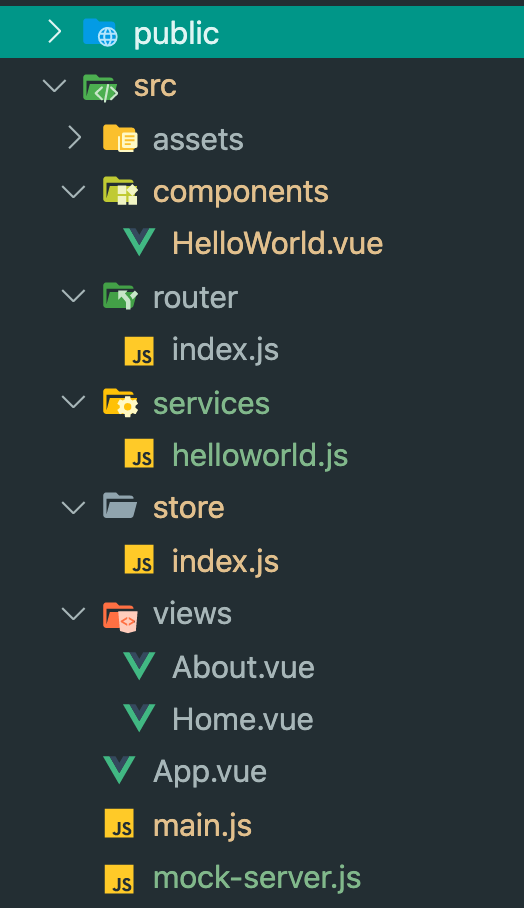

# Vue.js architecture sample: views

This is a sample architecture for Vue.js projects based on `views`. The views are application pages and components are used by them. 

<br>

### npm packages used:

- `vuex` -  data store
- `vue-router` - routing
- `vue-axios` - backend calls
- `mirage.js` - mocking api calls

<br>

## Folders structure:



<br><br>


### The `views` and `components` folders:
- `views` - one folder containing all the pages of the application
- `components` - one folder containing all the components used in pages


### Global folders:

- `router` - contains all the routes of the application
- `store` - contains the global store 
- `services` - file to contain all the api calls and any logic functions needed by vue components
- `mock-server` - (file) contains mocks for the apis used in the application. The mocks are disabled automaticaly when `environment != development`

For api mocking, the following axios package was used: [miragejs](https://github.com/miragejs/miragejs)

## Project setup
```
npm install
```

### Compiles and hot-reloads for development
```
npm run serve
```

### Compiles and minifies for production
```
npm run build
```

### Customize configuration
See [Configuration Reference](https://cli.vuejs.org/config/).


<br><br>
Happy coding!,<br>
@Imhotepp